# Multi-Vendor E-Commerce App — Full Project Scope

A production-grade multi-vendor marketplace built with a **Flutter mobile storefront**, **Flutter web vendor dashboard**, **Flutter web admin dashboard**, and a **Node.js + TypeScript backend** — integrated with **Stripe** for payments and real-time **order tracking**.

---

## 1. System Architecture

```mermaid
graph TD
    subgraph "Client Apps"
        A["📱 Storefront<br/>Flutter Mobile (Bloc)"]
        B["🏪 Vendor Dashboard<br/>Flutter Web (Bloc)"]
        C["🛡️ Admin Dashboard<br/>Flutter Web (Bloc)"]
    end

    subgraph "Backend"
        D["Node.js + Express<br/>TypeScript REST API"]
        E["PostgreSQL<br/>+ Prisma ORM"]
        F["Redis<br/>Session / Cache"]
        G["Stripe API<br/>Payments + Connect"]
        H["Firebase Cloud Messaging<br/>Push Notifications"]
        I["Cloudinary / S3<br/>Image Storage"]
    end

    A --> D
    B --> D
    C --> D
    D --> E
    D --> F
    D --> G
    D --> H
    D --> I
```



### Tech Stack

| Layer | Technology |
|---|---|
| **Storefront** | Flutter 3.x (mobile), Dart, Bloc (state mgmt), GoRouter, Dio |
| **Vendor Dashboard** | Flutter 3.x (web), Dart, Bloc, GoRouter, Dio |
| **Admin Dashboard** | Flutter 3.x (web), Dart, Bloc, GoRouter, Dio |
| **Backend** | Node.js 20+, Express.js, **TypeScript** |
| **Database** | **PostgreSQL** with **Prisma ORM** |
| **Auth** | JWT (access + refresh tokens), bcrypt |
| **Payments** | Stripe (Checkout, PaymentIntents, Connect for vendors) |
| **Storage** | Cloudinary (product images, avatars) |
| **Notifications** | Firebase Cloud Messaging (FCM) |
| **Cache** | Redis (sessions, OTP, rate-limiting) |
| **DevOps** | Docker, GitHub Actions CI/CD |

### Repository Structure

```
multi-vendor-e-commerce-app/
├── backend/                  # Node.js + Express + TypeScript + Prisma
├── storefront/               # Flutter mobile app (customer)
├── vendor-dashboard/         # Flutter web app (vendor)
├── admin-dashboard/          # Flutter web app (admin)
├── PROJECT_SCOPE.md
├── GITHUB_ISSUES.md
└── scripts/
```

---

## 2. User Roles & Features

### 👤 Customer (Storefront — Flutter Mobile)

| Module | Features |
|---|---|
| **Auth** | Email/password sign-up & login, Google OAuth, forgot-password (OTP), profile management |
| **Home** | Featured banners, category grid, trending products, recently viewed |
| **Product Browsing** | Category & sub-category filtering, search with auto-suggest, sort (price, rating, newest), product detail with image carousel, reviews & ratings |
| **Cart** | Add/remove items, quantity adjustment, multi-vendor cart separation, coupon/promo code |
| **Checkout** | Address management (add/edit/delete), shipping method selection, Stripe payment (card, Apple Pay, Google Pay), order summary |
| **Orders** | Order history with status timeline, real-time order tracking (placed → confirmed → shipped → delivered), cancel/return request |
| **Wishlist** | Save products, move to cart |
| **Notifications** | Push notifications for order updates, deals, price drops |

### 🏪 Vendor (Vendor Dashboard — Flutter Web)

| Module | Features |
|---|---|
| **Auth** | Vendor registration (with approval flow), login, profile & store setup |
| **Store** | Store name, logo, banner, description, policies (return, shipping) |
| **Products** | CRUD products with variants (size, color), image upload (up to 5), inventory tracking, bulk import (CSV) |
| **Orders** | View incoming orders, update status (confirm → pack → ship with tracking number), handle returns |
| **Earnings** | Dashboard showing total sales, pending payouts, commission breakdown |
| **Payouts** | Stripe Connect onboarding, payout history, bank account management |
| **Analytics** | Sales charts (daily/weekly/monthly), top products, conversion rate |

### 🛡️ Admin (Admin Dashboard — Flutter Web)

| Module | Features |
|---|---|
| **User Mgmt** | View/ban customers, approve/reject vendor applications |
| **Product Mgmt** | Approve/flag/remove products, manage categories |
| **Orders** | View all orders, handle disputes |
| **Finance** | Platform commission settings, revenue reports |
| **Config** | Manage banners, featured products, promo codes |
| **Analytics** | Platform-wide stats: total users, orders, revenue, vendor performance |

---

## 3. Folder Structures

### Storefront — Flutter Mobile (`/storefront`)

```
storefront/
├── lib/
│   ├── main.dart
│   ├── app.dart
│   ├── core/
│   │   ├── constants/          # API URLs, colors, strings
│   │   ├── theme/              # AppTheme, text styles, dark mode
│   │   ├── utils/              # Helpers, formatters, validators
│   │   ├── network/            # Dio client, interceptors, API exceptions
│   │   └── routing/            # GoRouter config, route names
│   ├── features/
│   │   ├── auth/
│   │   │   ├── data/           # AuthRepository, models, data sources
│   │   │   ├── bloc/           # AuthBloc, AuthEvent, AuthState
│   │   │   └── presentation/   # Screens, widgets
│   │   ├── home/
│   │   ├── products/
│   │   ├── cart/
│   │   ├── checkout/
│   │   ├── orders/
│   │   ├── wishlist/
│   │   ├── profile/
│   │   └── notifications/
│   └── shared/
│       ├── widgets/            # Reusable UI components
│       ├── models/             # Shared data models
│       └── blocs/              # Global blocs (user, cart, theme)
├── assets/
├── test/
└── pubspec.yaml
```

### Vendor Dashboard — Flutter Web (`/vendor-dashboard`)

```
vendor-dashboard/
├── lib/
│   ├── main.dart
│   ├── app.dart
│   ├── core/                   # Same structure as storefront
│   ├── features/
│   │   ├── auth/
│   │   ├── dashboard/          # Overview stats, charts
│   │   ├── store_setup/        # Store profile management
│   │   ├── products/           # Product CRUD, variants, images
│   │   ├── orders/             # Incoming orders, status management
│   │   ├── earnings/           # Revenue, payouts
│   │   └── analytics/          # Sales charts, top products
│   └── shared/
├── web/
├── test/
└── pubspec.yaml
```

### Admin Dashboard — Flutter Web (`/admin-dashboard`)

```
admin-dashboard/
├── lib/
│   ├── main.dart
│   ├── app.dart
│   ├── core/
│   ├── features/
│   │   ├── auth/
│   │   ├── dashboard/          # Platform-wide stats
│   │   ├── users/              # User management, banning
│   │   ├── vendors/            # Vendor approval/rejection
│   │   ├── products/           # Product moderation
│   │   ├── categories/         # Category management
│   │   ├── orders/             # All orders, disputes
│   │   ├── finance/            # Revenue, commissions
│   │   ├── banners/            # Promotional banners
│   │   └── promo_codes/        # Promo code management
│   └── shared/
├── web/
├── test/
└── pubspec.yaml
```

### Node.js Backend (`/backend`)

```
backend/
├── src/
│   ├── server.ts               # Entry point
│   ├── app.ts                  # Express app config
│   ├── config/
│   │   ├── env.ts              # Environment variables
│   │   ├── redis.ts            # Redis connection
│   │   └── stripe.ts           # Stripe init
│   ├── middleware/
│   │   ├── auth.ts             # JWT verification
│   │   ├── role.ts             # Role-based access (customer/vendor/admin)
│   │   ├── validate.ts         # Request validation (Zod)
│   │   ├── upload.ts           # Multer + Cloudinary
│   │   ├── rateLimiter.ts
│   │   └── errorHandler.ts
│   ├── modules/
│   │   ├── auth/
│   │   │   ├── auth.controller.ts
│   │   │   ├── auth.service.ts
│   │   │   ├── auth.routes.ts
│   │   │   └── auth.validation.ts
│   │   ├── product/
│   │   ├── category/
│   │   ├── cart/
│   │   ├── order/
│   │   ├── payment/
│   │   ├── review/
│   │   ├── vendor/
│   │   ├── wishlist/
│   │   ├── notification/
│   │   └── admin/
│   ├── utils/
│   │   ├── apiResponse.ts
│   │   ├── apiError.ts
│   │   ├── logger.ts
│   │   └── email.ts            # Nodemailer
│   └── types/
│       └── index.d.ts
├── prisma/
│   ├── schema.prisma           # Database schema
│   └── migrations/             # Auto-generated migrations
├── tests/
├── .env.example
├── tsconfig.json
├── Dockerfile
└── package.json
```

---

## 4. Database Schema (PostgreSQL + Prisma)

```mermaid
erDiagram
    User ||--o{ Order : places
    User ||--o{ Review : writes
    User ||--o{ Address : has
    User ||--|| VendorProfile : "may have"
    VendorProfile ||--o{ Product : sells
    Product ||--o{ Variant : has
    Product }o--|| Category : "belongs to"
    Category ||--o{ Category : "has subcategories"
    Order ||--|{ OrderItem : contains
    OrderItem }o--|| Product : references
    Order ||--|| Payment : "paid via"
    User ||--o| Cart : has
    Cart ||--o{ CartItem : contains
    User ||--o{ WishlistItem : saves

    User {
        uuid id PK
        string name
        string email UK
        string password
        enum role "CUSTOMER | VENDOR | ADMIN"
        string avatar
        string fcmToken
        boolean isVerified
        boolean isBanned
        datetime createdAt
        datetime updatedAt
    }

    VendorProfile {
        uuid id PK
        uuid userId FK UK
        string storeName
        string storeLogo
        string storeBanner
        string description
        enum status "PENDING | APPROVED | REJECTED"
        string stripeAccountId
        json bankDetails
        datetime createdAt
    }

    Product {
        uuid id PK
        uuid vendorId FK
        uuid categoryId FK
        string name
        text description
        decimal basePrice
        string[] images
        boolean isActive
        float avgRating
        int reviewCount
        string[] tags
        datetime createdAt
        datetime updatedAt
    }

    Variant {
        uuid id PK
        uuid productId FK
        string size
        string color
        decimal price
        int stock
        string sku UK
    }

    Category {
        uuid id PK
        string name
        string slug UK
        string image
        uuid parentId FK
    }

    Order {
        uuid id PK
        string orderNumber UK
        uuid customerId FK
        uuid addressId FK
        enum status "PLACED | CONFIRMED | SHIPPED | DELIVERED | CANCELLED | RETURNED"
        decimal totalAmount
        decimal discount
        string trackingNumber
        datetime createdAt
        datetime updatedAt
    }

    OrderItem {
        uuid id PK
        uuid orderId FK
        uuid productId FK
        uuid variantId FK
        uuid vendorId FK
        int quantity
        decimal price
        enum itemStatus "PENDING | CONFIRMED | SHIPPED | DELIVERED"
    }

    Payment {
        uuid id PK
        uuid orderId FK UK
        string stripePaymentIntentId UK
        decimal amount
        enum status "PENDING | SUCCEEDED | FAILED | REFUNDED"
        string method
        datetime createdAt
    }

    Cart {
        uuid id PK
        uuid userId FK UK
    }

    CartItem {
        uuid id PK
        uuid cartId FK
        uuid productId FK
        uuid variantId FK
        int quantity
    }

    Review {
        uuid id PK
        uuid userId FK
        uuid productId FK
        int rating
        text comment
        datetime createdAt
    }

    Address {
        uuid id PK
        uuid userId FK
        string label
        string street
        string city
        string state
        string zip
        string country
        string phone
        boolean isDefault
    }

    WishlistItem {
        uuid id PK
        uuid userId FK
        uuid productId FK
        datetime createdAt
    }

    PromoCode {
        uuid id PK
        string code UK
        enum discountType "PERCENTAGE | FLAT"
        decimal value
        decimal minOrderAmount
        int maxUses
        int usedCount
        datetime expiresAt
        boolean isActive
    }

    Banner {
        uuid id PK
        string title
        string imageUrl
        string linkUrl
        int position
        boolean isActive
        datetime createdAt
    }

    Notification {
        uuid id PK
        uuid userId FK
        string title
        string body
        string type
        boolean isRead
        datetime createdAt
    }
```

---

## 5. API Routes

### Auth (`/api/v1/auth`)

| Method | Endpoint | Description | Access |
|---|---|---|---|
| POST | `/register` | Register (customer or vendor) | Public |
| POST | `/login` | Login, returns JWT | Public |
| POST | `/refresh-token` | Refresh access token | Public |
| POST | `/forgot-password` | Send OTP | Public |
| POST | `/reset-password` | Reset with OTP | Public |
| GET | `/me` | Get current user profile | Auth |
| PUT | `/me` | Update profile | Auth |
| POST | `/logout` | Invalidate refresh token | Auth |

### Products (`/api/v1/products`)

| Method | Endpoint | Description | Access |
|---|---|---|---|
| GET | `/` | List products (paginated, filterable) | Public |
| GET | `/:id` | Product detail | Public |
| GET | `/search?q=` | Search products | Public |
| POST | `/` | Create product | Vendor |
| PUT | `/:id` | Update product | Vendor (owner) |
| DELETE | `/:id` | Delete product | Vendor (owner) |
| POST | `/:id/variants` | Add variant | Vendor (owner) |
| PUT | `/:id/variants/:vid` | Update variant | Vendor (owner) |

### Categories (`/api/v1/categories`)

| Method | Endpoint | Description | Access |
|---|---|---|---|
| GET | `/` | List all categories | Public |
| POST | `/` | Create category | Admin |
| PUT | `/:id` | Update category | Admin |
| DELETE | `/:id` | Delete category | Admin |

### Cart (`/api/v1/cart`)

| Method | Endpoint | Description | Access |
|---|---|---|---|
| GET | `/` | Get user cart | Customer |
| POST | `/items` | Add item to cart | Customer |
| PUT | `/items/:itemId` | Update quantity | Customer |
| DELETE | `/items/:itemId` | Remove item | Customer |
| DELETE | `/` | Clear cart | Customer |
| POST | `/apply-promo` | Apply promo code | Customer |

### Orders (`/api/v1/orders`)

| Method | Endpoint | Description | Access |
|---|---|---|---|
| POST | `/` | Place order (from cart) | Customer |
| GET | `/` | Get my orders | Customer |
| GET | `/:id` | Order detail | Auth (owner) |
| PUT | `/:id/cancel` | Cancel order | Customer |
| GET | `/vendor` | Get vendor's incoming orders | Vendor |
| PUT | `/vendor/:id/status` | Update order item status | Vendor |

### Payments (`/api/v1/payments`)

| Method | Endpoint | Description | Access |
|---|---|---|---|
| POST | `/create-intent` | Create Stripe PaymentIntent | Customer |
| POST | `/webhook` | Stripe webhook handler | Stripe |
| GET | `/history` | Payment history | Auth |

### Reviews (`/api/v1/reviews`)

| Method | Endpoint | Description | Access |
|---|---|---|---|
| GET | `/product/:productId` | Get reviews for product | Public |
| POST | `/product/:productId` | Add review | Customer |
| PUT | `/:id` | Edit review | Customer (owner) |
| DELETE | `/:id` | Delete review | Customer (owner) / Admin |

### Vendor (`/api/v1/vendor`)

| Method | Endpoint | Description | Access |
|---|---|---|---|
| GET | `/profile` | Get vendor store profile | Vendor |
| PUT | `/profile` | Update store profile | Vendor |
| GET | `/earnings` | Earnings summary | Vendor |
| GET | `/analytics` | Sales analytics | Vendor |
| POST | `/stripe-onboard` | Start Stripe Connect onboard | Vendor |
| GET | `/payouts` | Payout history | Vendor |

### Wishlist (`/api/v1/wishlist`)

| Method | Endpoint | Description | Access |
|---|---|---|---|
| GET | `/` | Get wishlist | Customer |
| POST | `/:productId` | Add to wishlist | Customer |
| DELETE | `/:productId` | Remove from wishlist | Customer |

### Admin (`/api/v1/admin`)

| Method | Endpoint | Description | Access |
|---|---|---|---|
| GET | `/dashboard` | Dashboard stats | Admin |
| GET | `/users` | List all users | Admin |
| PUT | `/users/:id/ban` | Ban/unban user | Admin |
| GET | `/vendors/pending` | Pending vendor applications | Admin |
| PUT | `/vendors/:id/approve` | Approve/reject vendor | Admin |
| GET | `/products` | All products (with moderation flags) | Admin |
| PUT | `/products/:id/moderate` | Approve/flag/remove product | Admin |
| GET | `/orders` | All orders | Admin |
| GET | `/finance/revenue` | Revenue reports | Admin |
| PUT | `/finance/commission` | Update commission rate | Admin |
| POST | `/banners` | Create promotional banner | Admin |
| PUT | `/banners/:id` | Update banner | Admin |
| DELETE | `/banners/:id` | Delete banner | Admin |
| POST | `/promo-codes` | Create promo code | Admin |
| PUT | `/promo-codes/:id` | Update promo code | Admin |
| DELETE | `/promo-codes/:id` | Delete promo code | Admin |

### Addresses (`/api/v1/addresses`)

| Method | Endpoint | Description | Access |
|---|---|---|---|
| GET | `/` | List addresses | Auth |
| POST | `/` | Add address | Auth |
| PUT | `/:id` | Update address | Auth |
| DELETE | `/:id` | Delete address | Auth |

### Notifications (`/api/v1/notifications`)

| Method | Endpoint | Description | Access |
|---|---|---|---|
| GET | `/` | List notifications | Auth |
| PUT | `/:id/read` | Mark as read | Auth |
| PUT | `/read-all` | Mark all as read | Auth |

---

## 6. Milestone Plan

### Phase 1 — Foundation (Week 1–2)

> Project setup, auth, and core infrastructure

- **Backend**: Express + TypeScript scaffold, **Prisma + PostgreSQL** setup, JWT auth (register/login/refresh/forgot-password), User model, middleware (auth, roles, validation, error handler)
- **Storefront**: Flutter mobile project scaffold, theme setup, Dio client with interceptors, **Bloc** setup, GoRouter, auth screens (login, signup, forgot password), secure token storage
- **Vendor Dashboard**: Flutter web project scaffold, theme & Dio reuse, **Bloc** setup, vendor login screen
- **Admin Dashboard**: Flutter web project scaffold, theme & Dio reuse, **Bloc** setup, admin login screen

### Phase 2 — Products & Catalog (Week 3–4)

> Browsable product catalog with categories

- **Backend**: Category CRUD, product CRUD with variants, image upload to Cloudinary, search & filter endpoints, pagination
- **Storefront**: Home screen (banners, categories, trending), category listing, product list with filters/sort, product detail with image carousel, search with auto-suggest
- **Admin Dashboard**: Category management screens

### Phase 3 — Cart & Checkout (Week 5–6)

> Complete purchase flow

- **Backend**: Cart API, address API, order creation, Stripe PaymentIntent, webhook handling, order status management, promo code engine
- **Storefront**: Cart screen (multi-vendor separation), address management, checkout flow, Stripe payment sheet integration, order confirmation screen

### Phase 4 — Orders & Tracking (Week 7)

> Post-purchase experience

- **Backend**: Order history, status timeline, cancel/return endpoints, push notification triggers
- **Storefront**: Order history screen, order detail with status timeline, cancel/return flow, push notification setup (FCM)

### Phase 5 — Reviews, Wishlist & Notifications (Week 8)

> Engagement features

- **Backend**: Review CRUD, wishlist API, notification service
- **Storefront**: Product reviews UI, write review screen, wishlist screen, notification center

### Phase 6 — Vendor Dashboard (Week 9–10)

> Vendor-facing features

- **Backend**: Vendor profile setup, Stripe Connect onboarding, vendor order management, earnings & analytics endpoints, CSV product import
- **Vendor Dashboard**: Store setup screen, product management (CRUD), vendor order list with status controls, earnings dashboard with charts, analytics page

### Phase 7 — Admin Dashboard (Week 11–12)

> Admin panel + platform management

- **Backend**: Admin endpoints (user mgmt, product moderation, finance, banners, promo codes)
- **Admin Dashboard**: Dashboard with platform stats, user management, vendor approvals, product moderation, order overview, revenue reports, banner & promo code management

### Phase 8 — Polish & Launch (Week 13–14)

> Quality, performance, and deployment

- **Backend**: Rate limiting, logging, API documentation (Swagger), Docker setup, CI/CD pipeline
- **All Flutter apps**: Skeleton loaders, error states, empty states, dark mode, responsive layouts
- **Storefront**: App icon, splash screen, deep linking
- **Testing**: Unit tests (backend services), integration tests (API endpoints), widget tests (Flutter), E2E flow testing
- **Deployment**: Backend to Railway/Render/AWS, PostgreSQL hosted (Supabase/Railway/RDS), Stripe live keys, Flutter web apps to Firebase Hosting / Vercel

---

## 7. Key Technical Decisions

| Decision | Choice | Rationale |
|---|---|---|
| State management | **Bloc** | Industry standard, scalable, testable |
| Backend language | **TypeScript** | Type safety, better DX, strong job market signal |
| Database | **PostgreSQL + Prisma** | Relational data fits e-commerce, type-safe ORM, SQL skills valued by employers |
| Vendor Dashboard | **Separate Flutter web app** | Portfolio showcases Flutter web skills |
| Admin Dashboard | **Separate Flutter web app** | Complete platform management, additional portfolio piece |
| Auth | **JWT (access + refresh)** | Stateless, works across all 3 client apps |
| Payments | **Stripe + Connect** | Industry standard, vendor payouts built-in |
